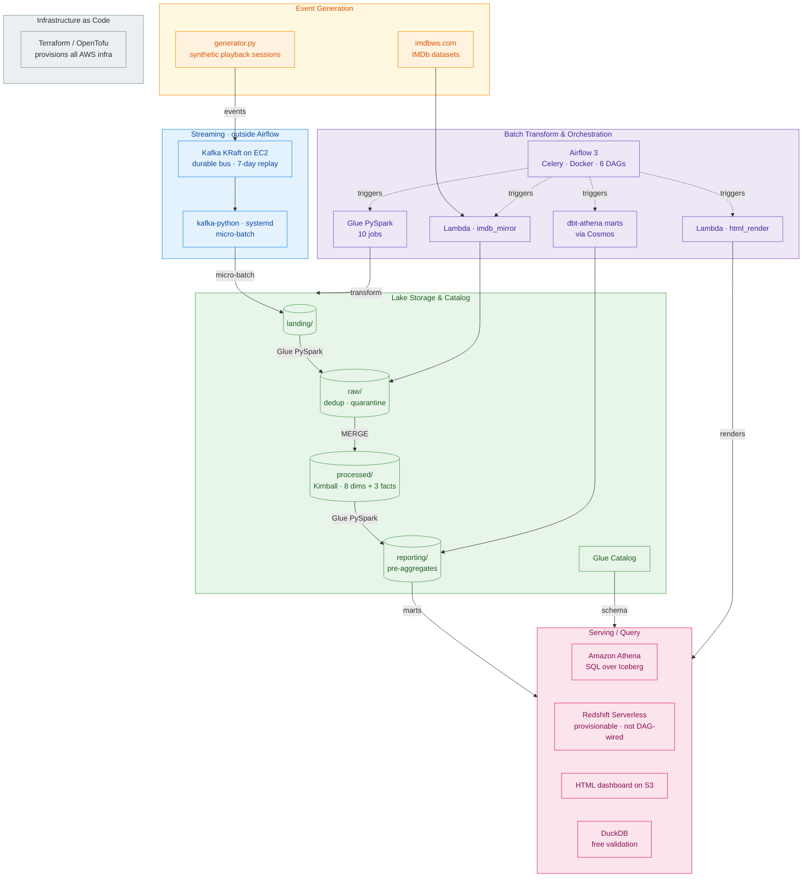

# Full-Stack Data Engineering — Streaming Data Warehouse on AWS

An end-to-end, production-shaped data platform for streaming playback events: Kafka
ingest → S3 Iceberg lake (landing → raw → processed → reporting) → Kimball dimensional
model → Athena SQL and HTML reports, orchestrated by self-hosted Apache Airflow 3.

Everything here is organised around one question: **who watched what, on which device,
where, for how long — and did they finish?** Every report is a different cut of that
question, and every architectural choice — five lake zones, three fact grains, eight
conformed dimensions — exists to keep it cheap and reliable to answer.

---

## Architecture



Dotted lines are Airflow's control plane, and they reach the batch boxes only. The
producer, Kafka, and the consumer run continuously and sit deliberately **outside**
Airflow — Kafka's ≥7-day retention is the replay and DR source now that landing is
mutable Iceberg.

## Design

The full design doc is [skills/streaming/DESIGN.md](skills/streaming/DESIGN.md) (778 lines).
Condensed here so the repo explains itself without opening it.

| § | Covers |
|---|---|
| [1. Overview](#1-overview) | Problem, goals, non-goals, success metrics |
| [2. High-Level Design](#2-high-level-design) | Business context, source shape, pipeline, S3 layout, data model, reports, stack |
| [3. LLD — Data](#3-lld--data) | Kimball's four decisions, 8 dimension schemas, 3 fact schemas, per-zone processing, example SQL |
| [4. LLD — Orchestration](#4-lld--orchestration) | Why Airflow, Celery deployment, the DAGs, operators, idempotency |
| [5. LLD — Ops / Infra / Business](#5-lld--ops--infra--business) | Runbooks, cost, business framing |
| [6. Edge cases & validations](#6-edge-cases--validations) | Source-data edge cases, expected-vs-result checks |

### 1. Overview

**Problem.** Ingest device-emitted playback events, land them on S3, conform them through a
multi-zone lake, materialise a Kimball dimensional model, and serve business reports — all
observable end-to-end and orchestrated by a standard scheduling layer.

**Goals:** realistic event simulation joined to a real title catalog (IMDb) · multi-zone lake
where each zone owns one concern · Kimball model on Iceberg v2 at three fact grains ·
business-grade reports · Airflow orchestration · per-batch metadata written back for observability.

**Non-goals**, stated to bound the work: no recommender (the data is generated, not scored),
no sub-second personalisation, no multi-region active-active, no org-wide Airflow platform.

| Success metric | Target |
|---|---|
| Landing → raw freshness | ≤ 15 min p95 |
| Raw → processed freshness | ≤ 1 hr p95 |
| Processed → reporting freshness | ≤ 24 hr |
| Data quality score per zone | ≥ 70 / 100 — gates downstream |
| Airflow DAG-run success rate | ≥ 99.5% over rolling 7 days |

### 2. High-Level Design

Recommendations, content acquisition, and capacity planning are all downstream consumers of
the same base fact, so the platform optimises for capturing that fact cleanly.

**Source shape.** A device emits playback state incrementally, not a session summary:

```text
device_id  content_id  event_timestamp        position_ms  event_type
xxx        tt0088247   2026-05-20T20:00:00Z   0            play
xxx        tt0088247   2026-05-20T20:00:05Z   5000         heartbeat
xxx        tt0088247   2026-05-20T21:38:00Z   5700000      complete
```

Event types: `play`, `pause`, `seek`, `resume`, `complete`, `exit`. Sessions and daily
roll-ups are derived downstream — that shape is the only thing ingest needs to know.

**Why five zones rather than fewer:**

| Zone | Why it exists separately |
|---|---|
| `imdb_base/` | External vendor source on its own refresh cadence; isolation prevents accidental rebuilds |
| `landing/` | First queryable copy of what the bus produced. Replay/DR comes from **Kafka retention (≥7d)**, not from here — landing is a compacted Iceberg table, not byte-immutable |
| `raw/` | Single source of truth: deduped, type-cast. Decouples downstream from event-parsing cost |
| `processed/` | The Kimball model. Iceberg gives MERGE, time travel, schema evolution |
| `reporting/` | Query-optimised pre-aggregates, so reporting users don't pay processed-zone cost |

**Three fact grains, one business process:**

| Fact | Grain | Type | Audience |
|---|---|---|---|
| `fact_playback_events` | 1 row per atomic event | Transaction | Engineers, ML |
| `fact_view_sessions` | 1 row per continuous session | Accumulating snapshot | Product / UX |
| `fact_daily_engagement` | 1 row per customer × title × day | Periodic snapshot | Execs, BI |

**Reports:** top titles, most engaged users, watch time by country and device, completion
rate by content/type/genre, DAU/WAU/MAU, bitrate distribution, premiere-Friday lift.

**On the stack choices.** Self-managed Kafka, Glue PySpark, and self-hosted Airflow were
picked deliberately over a cheaper serverless design (Firehose + Athena CTAS) to exercise the
operational surface each one carries. Redshift Serverless is defined in Terraform but left out
of the DAGs — Athena serves the same Iceberg tables at Free-Plan cost.

### 3. LLD — Data

**Kimball's four decisions**, made in order and never re-ordered: the business process is
*content engagement / playback behaviour*; the grain is declared per table at three
resolutions; dimensions conform across all three facts; only additive measures live in
facts, with ratios like completion rate computed at query time.

| Dimension | SCD | Source |
|---|---|---|
| `dim_title` | 1 | IMDb basics + ratings + akas (`tconst` natural key) |
| `dim_customer` | 1 | `raw_customer_profiles` |
| `dim_device` / `dim_device_version` | 1 | `raw_device_registry` (version is a child of device) |
| `dim_genre` | 1 | derived from IMDb genres, pipe-split |
| `dim_date` / `dim_time_of_day` | static | generated |
| `dim_geography` | static | ISO 3166 lookup |

All dims are SCD Type 1 in V1; SCD2 is deferred until "title metadata as of viewing date"
becomes a real reporting need.

**The raw-zone transform** is where most of the correctness lives: read the current hour plus
a 90-minute lookback for late events, cast schema, dedup by `event_id` keeping the latest
`server_received_at`, quarantine bad rows, sort by `(session_id, event_timestamp)` so session
reconstruction downstream is cheap, then write Iceberg partitioned by `event_date, event_hour`.

Rows are quarantined for unknown event types, future client clocks, invalid title ids, missing
required fields, or arriving more than 24 h late.

### 4. LLD — Orchestration

Covered above in [Orchestration](#orchestration) with the as-built task chains. In short:
Airflow was chosen for a standard, industry-recognised scheduling/dependency/backfill layer
rather than a bespoke orchestrator; it runs CeleryExecutor on Docker with queue routing that
keeps Iceberg compaction on its own `maintenance` queue.

### 5. LLD — Ops / Infra / Business

**Quality gates** — every zone scores itself, and a score below 70 halts downstream:

| Zone | Check | Threshold |
|---|---|---|
| landing | Consumer lag (Kafka offset) | < 60 s; alert 5 min, page 15 min |
| raw | Dedup ratio | warn 1.05, alert 1.10 |
| raw | Quarantine rate | warn 1%, alert 5% |
| raw | Schema conformity | > 99.9%, else halt batch |
| processed | Dim FK orphan rate | < 0.1% → `_orphan_fk` quarantine |
| processed | Fact vs raw row count | within ±2% |

**Freshness SLAs:** device → landing ≤ 5 min p99 · landing → raw ≤ 15 min p95 · raw → facts
≤ 1 hr p95 · previous day → `fact_daily_engagement` by 06:00 UTC · reporting aggregates by
08:00 UTC. Each alert links to a runbook, and Athena over `run_metadata` answers "what broke?"

**Governance:** one IAM role per zone, each assumable only by its service principal; public
access denied; KMS at rest and TLS in transit; Lake Formation column grants (e.g. `email_hash`
masked); CloudTrail plus S3 access logs retained a year.

**Retention:** landing 7 days (bridge only — Kafka holds the authoritative replay window) ·
raw 90 days hot then 9 months Glacier · processed 3 years · reporting 5 years.

### 6. Edge cases & validations

The design enumerates the awkward cases up front rather than discovering them in production:

| Case | Handling |
|---|---|
| Device clock drifts > 5 min ahead of server | Quarantined at raw as "future client clock" |
| Event arrives > 24 h after its timestamp | Quarantined as stale; the session fact stops accepting late updates after the 24 h window |
| Session spans multiple hour partitions | Sort order preserved at raw write; stitched by the session accumulator |
| Customer has sessions but no `dim_customer` row | Orphan-FK check routes it to `_orphan_fk` |
| Title exists but never streams after launch | Cross-join title × date, flag 0 sessions in first 30 days |
| IMDb `\N` null sentinels | Converted to true SQL NULL by the imdb→raw job |
| Schema drift — a new event field appears | Captured into an `_extra_fields` map; recurring fields promoted at the next schema review |

**Measure invariants** checked daily, blocking the reporting refresh on failure:
`position_ms >= 0` · `session_end_ts >= session_start_ts` ·
`watch_duration <= session_duration` · `completion_pct BETWEEN 0 AND 1.001` (0.1% rounding
tolerance) · `fact_daily_engagement.total_watch_seconds` equals the sum of underlying session
watch durations.

## Repository layout

| Path | Contents |
|---|---|
| [airflow/](airflow/) | Dockerfile, Compose topology, DAGs, shared `common/` helpers |
| [glue/](glue/) | 10 PySpark jobs — the raw/processed/reporting transforms |
| [kafka/](kafka/) | Broker bootstrap, producer, consumer, systemd units |
| [lambda/](lambda/) | `imdb_mirror` and `html_render` handlers |
| [dbt/streaming/](dbt/streaming/) | dbt-athena reporting marts |
| [infra/terraform/](infra/terraform/) | S3, Glue, IAM, Kafka/DuckDB EC2, Redshift, alerting |
| [infra/terraform/airflow-ecs/](infra/terraform/airflow-ecs/) | Prod Airflow on Fargate (apply-on-demand) |
| [deploy/blue-green/](deploy/blue-green/) | Blue/green cutover scripts and runbook |
| [analytics/duckdb/](analytics/duckdb/) | Zero-infra validation over the Iceberg tables |
| [common/](common/) | Shared reconciliation assertions |
| [streaming-generator/](streaming-generator/) | Synthetic playback event generator |
| [streaming-etl/](streaming-etl/) | Original Athena CTAS implementation, kept as a validation baseline |
| [skills/streaming/](skills/streaming/) | Per-zone design notes and the full design doc |

## Pipeline stages

| Stage | Compute | Storage |
|---|---|---|
| imdbws → `imdb_base` | Lambda (streams `.gz`, no decompress) | S3 TSV.gz |
| `imdb_base` → raw | Glue PySpark | Iceberg |
| generator → Kafka | EC2 Python producer via SSM | Kafka (KRaft) |
| Kafka → landing | EC2 consumer, systemd, micro-batch | Iceberg, hour-partitioned |
| landing → raw | Glue PySpark G.1X, 4–10 DPU | Iceberg |
| raw → processed (dims) | Glue PySpark + Iceberg-Spark | Iceberg |
| raw → processed (facts) | Glue PySpark, `MERGE` | Iceberg |
| processed → reporting | Glue PySpark | Iceberg v2 pre-agg |
| Iceberg compaction | Glue `rewrite_data_files` / `expire_snapshots` | Iceberg |
| reporting → BI / email | Athena + Lambda `html_render` | Iceberg via Athena; HTML on S3 |
| reporting → dbt marts | dbt-athena via Cosmos | Iceberg |
| daily DQ audit | Athena queries → SNS | — |

The one stage Airflow does **not** orchestrate is Kafka → landing: that consumer runs
continuously under systemd. See [Orchestration](#orchestration) for what triggers the rest.

## Orchestration

Airflow 3.2.2, CeleryExecutor, running on Docker Compose in dev and ECS Fargate in prod
(committed but applied on demand, then destroyed).

| DAG | Schedule | Does |
|---|---|---|
| `imdb_monthly` | `@monthly` | Mirrors IMDb datasets, loads to raw. Emits Asset `imdb_raw` |
| `streaming_microbatch` | `*/15 * * * *` | landing → raw → DQ gate → playback/session facts |
| `daily_rollup` | Asset `raw_events` + `0 2 * * *` | Dims, daily engagement, aggregates, validation gate, HTML render |
| `iceberg_maintenance` | `30 3 * * *` | Compaction on the `maintenance` queue, after the rollup |
| `reporting_marts_dbt` | manual (`schedule=None`) | dbt-athena marts rendered via Cosmos |
| `dq_scorecard` | `0 6 * * *` | Out-of-band DQ scorecard, published to SNS |

The task chains, as they actually run:

```text
imdb_monthly                @monthly
  lambda_mirror_imdb >> glue_imdb_to_raw                      -> Asset: IMDB_RAW

streaming_microbatch        */15 * * * *
  wait_landing >> glue_raw_events
    >> dq_check                  GATE: quarantine % / volume, fails fast
    >> glue_fact_playback_events
    >> glue_fact_view_sessions   MERGE, 24h late window
    >> write_run_metadata                                     -> Asset: RAW_EVENTS

daily_rollup                Asset(RAW_EVENTS) + 0 2 * * *
  glue_dims_refresh >> glue_fact_daily_engagement
    >> glue_reporting_aggregates
    >> validate_etl              10 reconciliation assertions
    >> lambda_render_html >> write_run_metadata

iceberg_maintenance         30 3 * * *
  glue_compaction_landing >> glue_compaction_facts

reporting_marts_dbt         manual
  Cosmos renders each dbt model and its tests as individual tasks

dq_scorecard                0 6 * * *
  queries the live tables >> publishes the scorecard to SNS
```

Note the gate's position in `streaming_microbatch`: it runs on the **raw** zone
before any fact is built, so bad data fails the run rather than propagating into
the dimensional model.

Tasks are keyed by `data_interval_start`, so partitions and `MERGE` targets are
deterministic and `catchup` backfills cleanly. Every run writes to a `run_metadata`
Iceberg table (rows in/out, dedup ratio, quarantine %, lag p99) queryable from Athena;
lineage is DAG edges plus Assets.

## Data quality

Four layers, deliberately overlapping:

- **`common/validation.py`** — 10 reconciliation assertions, called as an Airflow gating
  task so a failure halts the downstream build.
- **dbt tests** — schema and relationship tests on the reporting marts.
- **`analytics/duckdb/validate.sql`** — reads the *same* Iceberg tables straight from S3,
  in-process and free, as an independent check on Athena's answers.
- **`dq_scorecard`** — trends quality metrics over time and alerts via SNS.

## Getting started

The generator and the DuckDB validation layer run with no AWS account at all.

```bash
# Synthetic events, no infrastructure
cd streaming-generator && pip install -r requirements.txt
python generator.py --help

# Validate marts against the Iceberg tables (reads S3, no Athena cost)
brew install duckdb
duckdb < analytics/duckdb/validate.sql
```

Local Airflow:

```bash
cd airflow
cp .env.example .env          # set AIRFLOW_VAR_STREAMING_S3_BUCKET and AWS creds
docker compose up -d          # scheduler, webserver:8080, triggerer, worker, redis, postgres
docker compose up --scale airflow-worker=3    # demo scale-out
```

Infrastructure:

```bash
cd infra/terraform
cp terraform.tfvars.example terraform.tfvars   # set project, buckets, region
terraform init && terraform plan
```

> **Heads up:** the data bucket lives in `us-west-2` while Glue and Athena run in
> `us-east-1` (an org SCP blocks `us-west-2` for the IAM user). Cross-region S3 reads
> are fine at this scale, but the split trips people up on first run.

## Deployment

Airflow is stateful and the data plane is shared — one Iceberg warehouse, one Glue
catalog, one Kafka cluster. So blue/green here means **both stacks run, only one is
active**, where "active" means its DAGs are unpaused. Two active stacks would double-write
the same Iceberg tables. See [deploy/blue-green/](deploy/blue-green/) for the runbook and
cutover scripts.

CI validates that every DAG imports and parses; a separate workflow exposes backfills as
a manually triggered job with DAG, task, and downstream as form inputs.

## Cost

At 50 GB/day ingest (~30M events/day), per [DESIGN.md §5.2](skills/streaming/DESIGN.md):

| Component | Estimated $/day |
|---|---|
| Glue PySpark (~7 DPU-hr/day, all zones + compaction) | $3.10 |
| S3 storage + requests (~3 TB over 90-day lifecycle) | $2.00 |
| Kafka brokers (EC2, KRaft, always-on) | $1.50 |
| Landing consumer (EC2, systemd, always-on) | $0.80 |
| Athena + Redshift Serverless reads | $0.55 |
| **Data plane total, always-on** | **~$8/day** |

Airflow is separate: **$0** in dev (Docker Compose on one host), ~$70–100/mo in prod *only
while the ECS stack is applied* — the default state is destroyed, spun up for demos. Steady
state is therefore the ~$8/day data plane.

Efficiency levers: lifecycle policies per zone, Iceberg `write.target-file-size-bytes` ≈ 128 MB,
daily `rewrite_data_files` + `expire_snapshots` to defeat the streaming small-file problem, and
Spot DPUs for Glue where the latency budget allows.

## Documentation

- [PLAN_v2.md](PLAN_v2.md) — the build plan: architecture, orchestration, IAM, sequence
- [skills/streaming/DESIGN.md](skills/streaming/DESIGN.md) — full design doc and Kimball model
- [skills/streaming/](skills/streaming/) — per-zone notes, source through reporting
